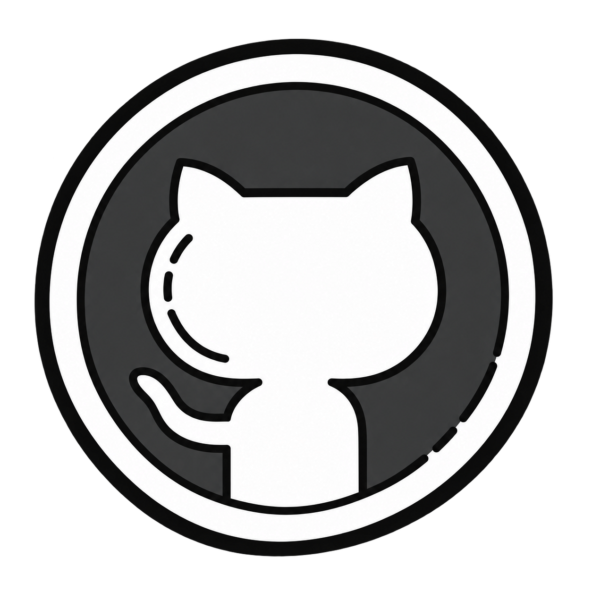

<h3>CS Graduate Student &nbsp;·&nbsp; Cybersecurity &nbsp;·&nbsp; Neuroscience Data Analysis</h3>

 

&nbsp;&nbsp;
&nbsp;&nbsp;

---

## About Me

**Computer science graduate student**

Interested in **cybersecurity** and **neuroscience data analysis**.

**Research** 
Most of my experience has focused on signal processing and data analysis for brain–heart signals and neuroimaging data.

**Interests** 
I enjoy working at the intersection of programming, data analysis, and neuroscience, while also continuing to explore cybersecurity and how these fields may connect.

 

## Experience

| Role | Where / What |
| --- | --- |
| **Research Intern** | Boston Children's Hospital |
| **Research Assistant** | Signal processing and analysis for brain–heart data |
| **1st Place** | MIT HackMX6 |

## 🛠️ Languages & Tools

  
  
  
  
  
  
  
  
  
  
  
  
  
  

## GitHub Stats

  
  

